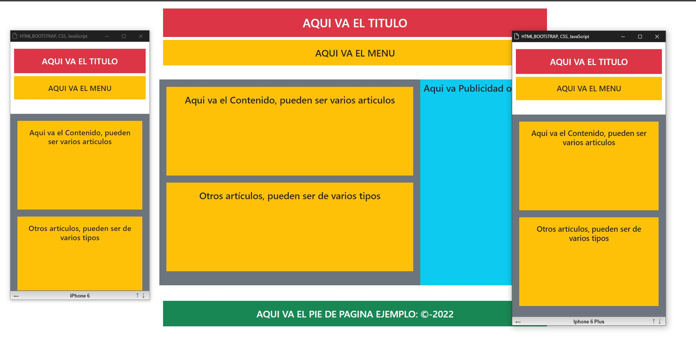

# CUARTO PROYECTO: INTRODUCCIÓN A BOOTSTRAP - ESTRUCTURA BÁSICA RESPONSIVA

Este proyecto es una introducción a Bootstrap y utiliza la librería Bootstrap desde una CDN para crear una estructura básica de página web con diseño responsive. Mantiene la misma estructura y diseño semántico que los proyectos anteriores, pero incorpora los componentes y estilos de Bootstrap.

## Contenido del Proyecto

- **index.html**: Archivo HTML principal que representa la estructura básica de la página web utilizando Bootstrap.

### Link de la Pagina: https://juancitopena.github.io/CUARTO_PROYECTO_INTRO_BOOTSTRAP_ESTRUCTURA_BASICA_RESPONSIVA/

# CAPTURAS DE PANTALLA:



## Uso de Bootstrap

Bootstrap se incorpora utilizando una CDN, lo que permite acceder a sus estilos y componentes en línea. Los componentes de Bootstrap, como el sistema de grillas, botones y navegación, se utilizan para crear una página web responsiva de manera eficiente.

## Estructura de la Página

La página HTML mantiene las etiquetas semánticas utilizadas en proyectos anteriores:

- El `<header>` contiene la cabecera de la página.
- La etiqueta `<nav>` representa la barra de navegación.
- El contenido principal se encuentra dentro de un `<article>`.
- El `<aside>` se utiliza para contenido relacionado o secundario.
- El `<footer>` contiene el pie de página.

## Cómo Usar

1. Clona este repositorio en tu máquina local:

```bash
git clone https://github.com/tuusuario/CUARTO_PROYECTO_INTRO_BOOTSTRAP_ESTRUCTURA_BASICA_RESPONSIVA.git
